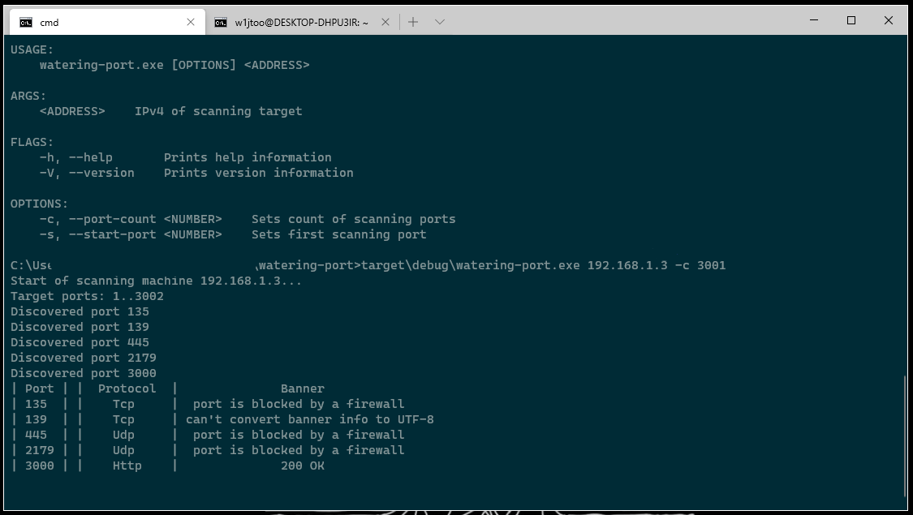

# watering-port

Watering-port is a tcp, udp scanner written in rust. Made due to Internet Protocols course in second year study of Institute of Mathematics and Mechanics UrFU.




## Install

Download binaries from [github release page](https://github.com/w1jtoo/watering-port/releases).

## Build

If you have rust compiler, for example cargo, you could do:
First you should clone repo.

```zsh
git clone https://github.com/w1jtoo/watering-port
cd watering-port
cargo build
```

Then you can scan e.g. google DNS server - 8.8.8.8, if you use windows:

```cmd
target\debug\watering-port.exe 8.8.8.8
```

Or Linux:

```zsh
./tartget/debug/watering-port 8.8.8.8
```

## Usage

```zsh
watering-port 192.168.1.3 -s 20 -c 1000
```

Will scan local machine with address 192.168.1.3 from 20 port up to 1020 port.  

## Options

| Command | Short | Description |
| :--------|:-----:| :------:|
| _--help_ | -h | show this |
| _--ports-count_ | -c | sets count of scanning ports |
| _--start-port_ | -s | sets first scanning port |

## How does it work

First of all, scanner find opened port using OS socket connection. If it connected it sends application layer protocols packet like HTTP/1.1 GET. Then, if scanning machine response something acceptable, scanner keep this information like banner, else it use same method but on transport layer, in this way we use TCP or UDP instead of HTTP.
